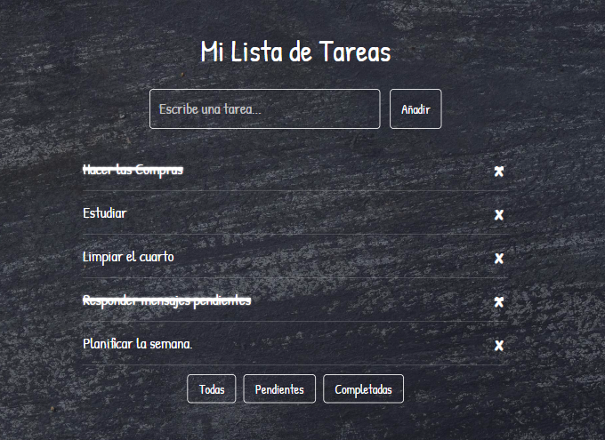

# 📝 Mi Lista de Tareas (To-Do List)

¡Una aplicación web sencilla y muy útil para gestionar tus tareas diarias! Organizá tu día a día agregando, marcando como completadas o eliminando tareas fácilmente.

✨ **¡Importante!** Tus tareas se guardan automáticamente en el navegador (LocalStorage), así que no se pierden aunque cierres y vuelvas a abrir la página.

---

## 📸 Vista Previa

¡Así es como se ve la aplicación!

---

## 🚀 Demo en Vivo

👉 [Ver la página aquí](https://samantainzerilli95.github.io/todo-list/)

---

## ✨ Funcionalidades

- **Añadir nuevas tareas**: Agregá rápidamente cualquier pendiente a tu lista.
- **Marcar como completadas**: Tachá las tareas que ya terminaste.
- **Eliminar tareas**: Borrá lo que ya no necesites.
- **Filtrar tareas**: Organizá tu vista para ver: "Todas", "Pendientes" o "Completadas".
- **Persistencia de datos**: Tus tareas se guardan localmente para que siempre estén ahí.

---

## 🎨 Estilo y Diseño

- **Fondo tipo pizarrón**: Una interfaz original que simula un pizarrón escolar.
- **Fuente manuscrita (Patrick Hand)**: Da un toque auténtico de "escritura con tiza".
- **Interfaz inspirada en escritura con tiza**: Todo el diseño evoca la experiencia de una pizarra.

---

## 📦 Tecnologías Utilizadas

- **HTML5**: Estructura base de la aplicación.
- **CSS3**: Estilos y diseño responsivo.
- **JavaScript**: Lógica principal y manejo de datos.
- **LocalStorage**: Para guardar y recuperar tus tareas en el navegador.
- **GitHub Pages**: Para el despliegue online del proyecto.

---

¡Gracias por visitar el proyecto! 💫
